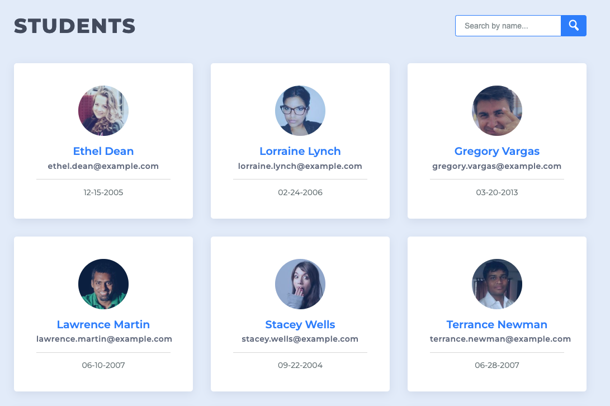

# Data_Pagination_Filtering

## Project Overview

This project is a web application that displays a list of students and their information. The list is paginated to display 9 students per page. The user can click on the pagination buttons to view the next or previous 9 students. The user can also search for a student by name. The search results are paginated as well.

